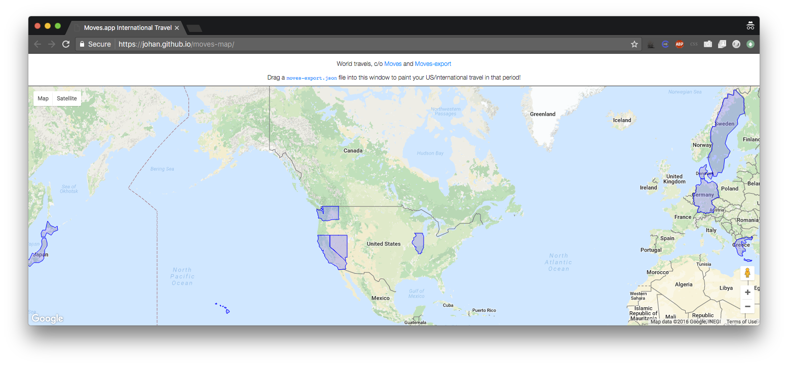

# Moves.app Map Visualizer

## About

If you are using the quantified self app [Moves](https://www.moves-app.com/),
this quick hack lets you show
what countries / US states you have been visiting,
since you started logging:

To try it out, you first need to
[download your location history](https://moves-export.herokuapp.com/),
then visit [the map](https://johan.github.io/moves-map/),
and drag and drop the json file onto your browser window.

No data will be uploaded either to Google Maps or elsewhere;
all location lookups are done statically on your own computer,
via [world.geo.json](https://github.com/johan/world.geo.json).

## Acknowledgements

* [Visual scaffolding](https://github.com/bramus/mercator-puzzle-redux)
  c/o @Bramus (thanks!)
